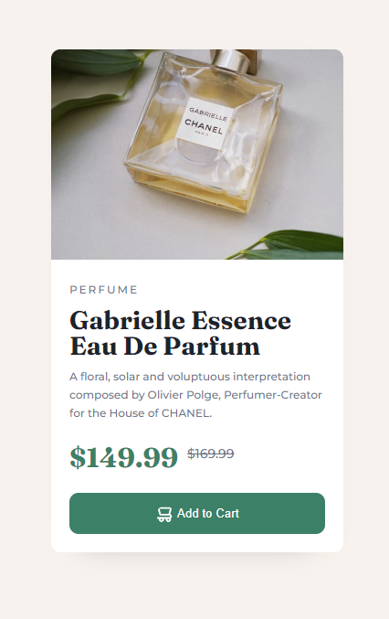

# Frontend Mentor - Product preview card component solution

This is a solution to the [Product preview card component challenge on Frontend Mentor](https://www.frontendmentor.io/challenges/product-preview-card-component-GO7UmttRfa). Frontend Mentor challenges help you improve your coding skills by building realistic projects. 

## Table of contents

- [Overview](#overview)
  - [The challenge](#the-challenge)
  - [Screenshot](#screenshot)
  - [Links](#links)
- [My process](#my-process)
  - [Built with](#built-with)
  - [What I learned](#what-i-learned)
  - [Continued development](#continued-development)
  - [Useful resources](#useful-resources)
- [Author](#author)
- [Acknowledgments](#acknowledgments)

**Note: Delete this note and update the table of contents based on what sections you keep.**

## Overview

### The challenge

Users should be able to:

- View the optimal layout depending on their device's screen size
- See hover and focus states for interactive elements

### Screenshot

 
 
 


### Links


- Live Site URL: [Product Preview Card](https://github.com/marayshiela/product-preview-card)

## My process
-create box like layout
-input html content
-add style
-create the layout based on screen
-double check codes

### Built with

- Semantic HTML5 markup
- CSS custom properties
- Flexbox
- CSS Grid


### What I learned

- I learned in this challenge that the image source/ background image can also be change when you switch from different breakpoints.
```html
<h1>Some HTML code I'm proud of</h1>
```
```css
.img-mobile{
  display: block !important;
  object-fit: cover;
  width: 320px;
  height: 100%;
  }
```

### Continued development
-complex html tags,
-complex css codes

### Useful resources

- [image swapping](https://stackoverflow.com/questions/27853884/media-queries-and-image-swapping) - This helped me in swaping the img from desktop to mobile view


## Author

- Website - [maray,shiela](https://www.your-site.com)
- Frontend Mentor - [@marayshiela](https://www.frontendmentor.io/profile/marayshiela)


## Acknowledgments
  
  Thank you FrontEnd Mentor!

